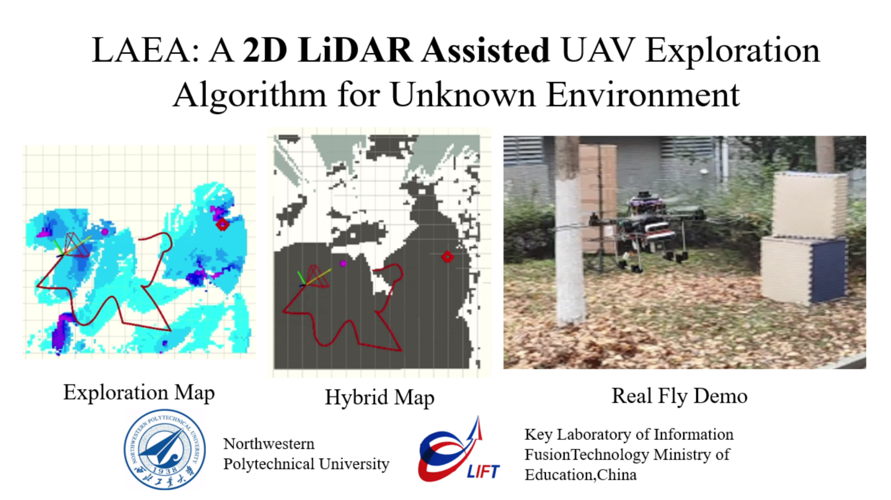
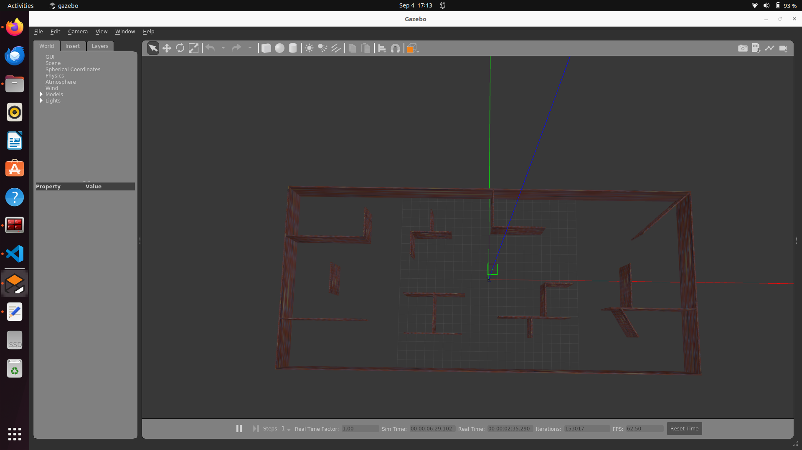
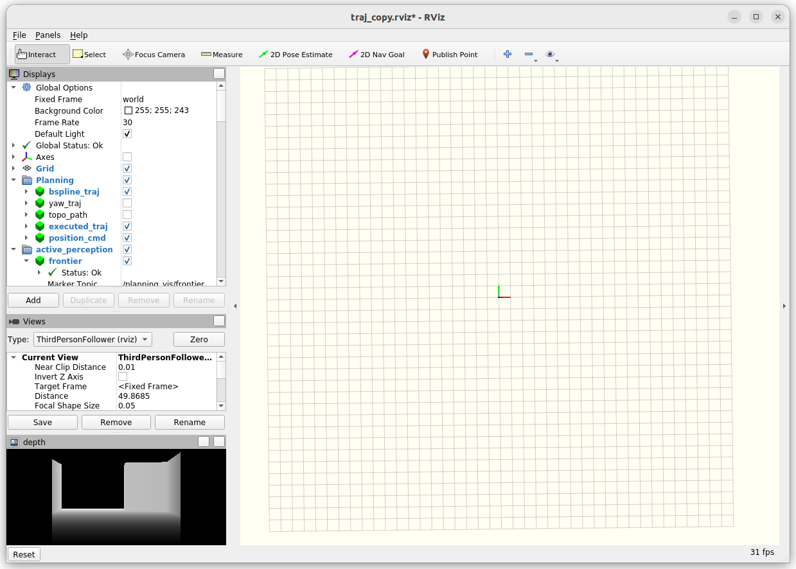
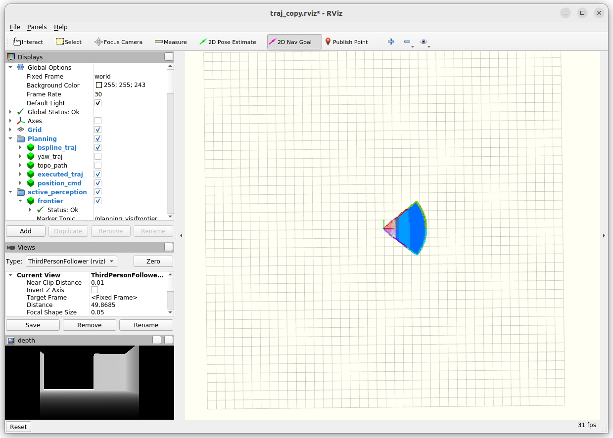

# LAEA: A 2D LiDAR-Assisted UAV Exploration Algorithm for Unknown Environments 

[**LAEA**]() is a 2D LiDAR-Assisted UAV Exploration Algorithm based on the framework of FAEP. The **main branch** of this project supports __Ubuntu 20 noetic__


Details about LAEA (Youtube).

<p align="center">
  <a href="https://youtu.be/_a1Vl518Ra8" target="_blank"></a>
</p>
The video is also available on bilibili (**Chinese mainland**): https://www.bilibili.com/video/BV1mm421n71N 

Original LAEA research paper:

- [**LAEA: A 2D LiDAR-Assisted UAV Exploration Algorithm for Unknown Environments **](https://www.mdpi.com/2504-446X/8/4/128), Hou, Xiaolei, Zheng Pan, Li Lu, Yuhang Wu, Jinwen Hu, Yang Lyu, and Chunhui Zhao. 2024, *Drones*.

```
@Article{drones8040128,
AUTHOR = {Hou, Xiaolei and Pan, Zheng and Lu, Li and Wu, Yuhang and Hu, Jinwen and Lyu, Yang and Zhao, Chunhui},
TITLE = {LAEA: A 2D LiDAR-Assisted UAV Exploration Algorithm for Unknown Environments},
JOURNAL = {Drones},
VOLUME = {8},
YEAR = {2024},
NUMBER = {4},
ARTICLE-NUMBER = {128},
URL = {https://www.mdpi.com/2504-446X/8/4/128},
ISSN = {2504-446X},
}
```

Simulation experiment quick overview: Indoor1、Indoor2 and Forest. 


## Dependencies (Setup for project)

```bash
# Download the LAEA project folders from edited repo
# for Ubuntu20.04 Noetic
git clone https://github.com/EdmundNegan/LAEA.git --recursive -b noetic

# Edit docker_run.sh line 12 with your path to LAEA folder e.g. "/home/intern/LAEA"
# Download docker image from https://hub.docker.com/repository/docker/edmundngan/laea/tags 
docker pull edmundngan/laea:latest
```


## Quick Start

Once the relevant environment has been configured (especially PX4), you can run simulation experiments using the provided code.

Build the environment for the project (Do this whenever C++ source files are edited)
```bash
# Run the docker container script
bash docker_run.sh

# path to workspace and catkin_make the environment
cd ros_ws
catkin_make
```

Code to start simulation and run exploration algorithm
```bash
################ 1) Start your simulation environment ###############
# My simulation environment boot example
bash docker_run.sh # If you haven't opened your container
roslaunch px4_gazebo laea_gazebo_lidar.launch # drone&sensor data&sim-env
```



```bash
################ 2) Activate your drone controller ##################
# We're using the default [mavros_controllers]
# If you want to use the controller for real flight, a carefully adjustment for the parameters is needed, otherwise... 
# Open a new terminal in original container
bash docker_exec.sh
roslaunch px4_gazebo controller.launch # controller
```

Switch back into first container 
```bash
# Arm the drone and change the flight mode to offboard
pxh> commander arm
pxh> commander mode offboard
# Drone should takeoff now
```

```bash
################ 3) Start the octomap mapping service ###############
# Open a new terminal in original container
bash docker_exec.sh
roslaunch octomap_server scan_mapping.launch # octomap mapping
```
```bash
################ 4) rviz for visualization ##########################
# Open a new terminal in original container
bash docker_exec.sh
roslaunch exploration_manager rviz_alg.launch # rviz 
```


```bash
################ 5) Activate our exploration algorithm ##############
# Open a new terminal in original container
bash docker_exec.sh
roslaunch exploration_manager explore_test.launch # exploration algorithm
```
Select 2D Nav Goal in Rviz and click on the map to start exploration and mapping
 

The above startup steps are very long, you can integrate them into a launch file and run it for simplicity's sake


Of course, **any simulation environment is fine** as long as it **provides the following data required** by the algorithm. Specifically, you need to modify the following files:

- exploration_manager/launch/poaozz/**explore_test.launch**: Provides drone and camera position and depth image

```lua
<!-- topic of your odometry such as VIO or LIO -->
<arg name="odom_topic" value="/mavros/local_position/odom" />

<!-- sensor pose: transform of camera frame in the world frame -->
<arg name="sensor_pose_topic" value="/mavros/camera/pose"/>

<!-- depth topic: depth image, 640x480 by default -->
<arg name="depth_topic" value="/camera/depth/image_raw"/>
```

- utils/depthimage_to_laserscan/launch/depth2scan.launch: Provides depth camera data to generate lidar scans

```lua
<!-- change here for your camera depth topic name. -->
<remap from="image"       to="/camera/depth/image_raw"/> 
<remap from="camera_info" to="/camera/depth/camera_info"/> 
```

- utils/laserscan_to_pointcloud/launch/cloud.launch: Provides 2d lidar data

```lua
<!-- lidar scan data -->
<arg name="laser_scan_topics" default="/iris_0/scan" />
```


## Guidelines for Parameters

As described in paper, LAEA enables efficient exploration of unknown environments by **timely access to the detected special frontier regions**. Therefore, you may need to refer to the meaning of the parameters and adjust them for the current exploration environment. Parameter file is located at `exploration_manager/launch/poaozz/algorithm_.xml`. The main parameters are as follows: 

```lua
<!-- atsp cost params  -->
<param name="frontier/small_area_thresh" value="2.0" type="double"/>
<param name="frontier/small_thresh_low" value="0.6" type="double"/>
<param name="frontier/isolateArea_gain" value="15" type="double"/>
<!-- max angle gap -->
<param name="exploration/max_yaw_gap" value="100" type="int"/>
<!-- Path time constraints when filtering for middle yaw -->
<param name="exploration/lens_lb_rate" value="1.35" type="double"/>
<param name="exploration/yaw_rotate_rate" value="1.2" type="double"/>
```


## Acknowledgements

Our code is developed based on [**FAEP**](https://github.com/Zyhlibrary/FAEP). We use **NLopt** for non-linear optimization and use **LKH** for travelling salesman problem.


